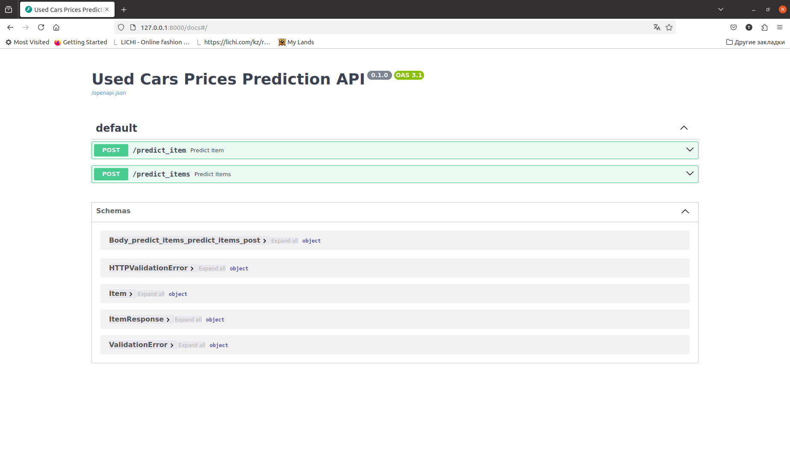
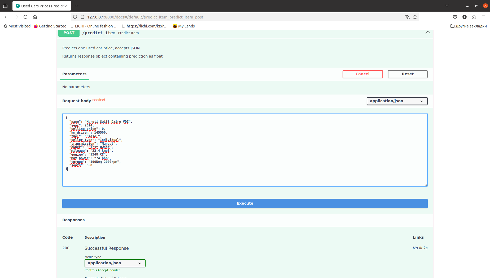
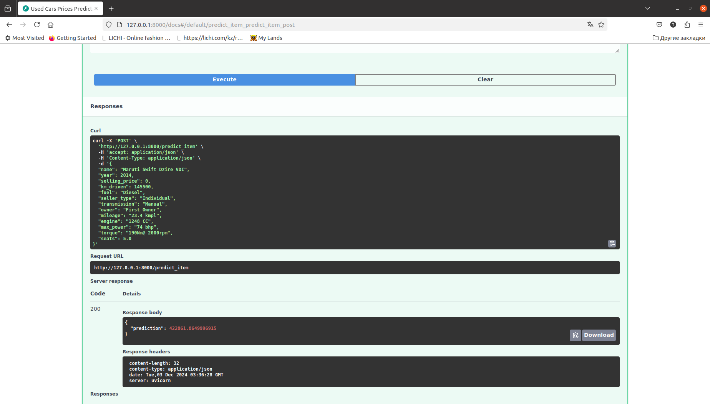
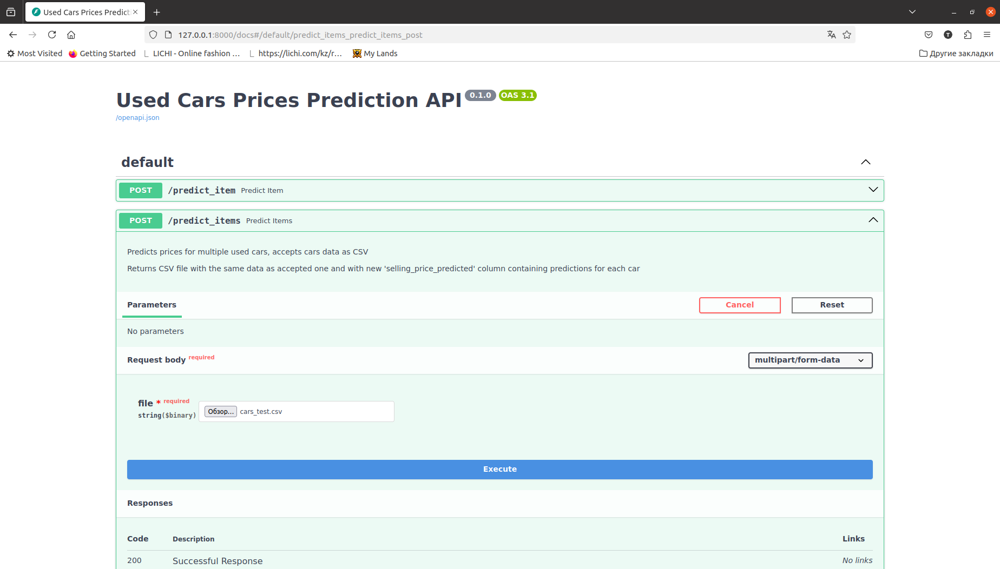
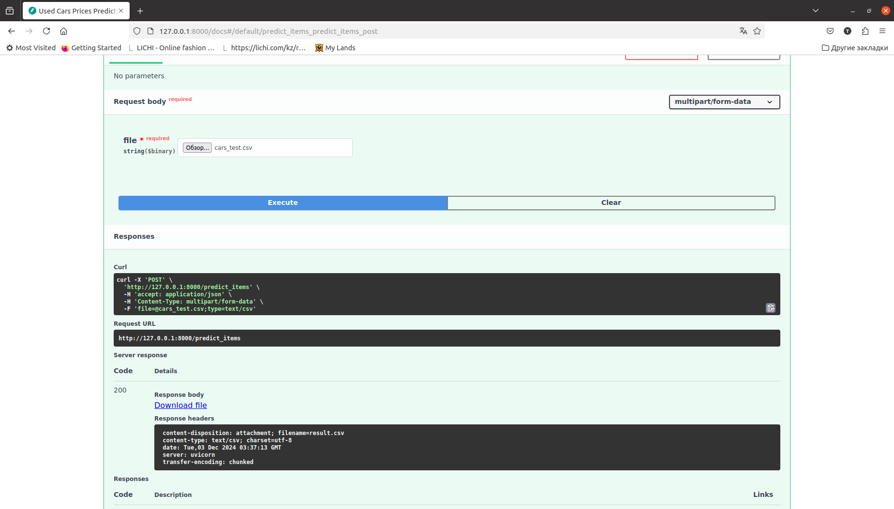
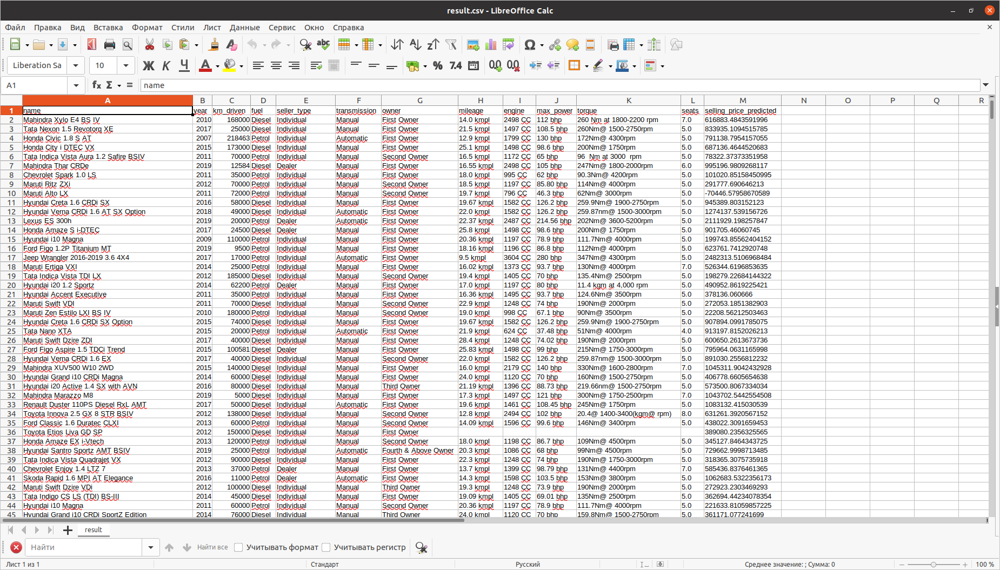

# Анализ данных о подержанных автомобилях и построение модели предсказания цен

## Done
- Выполнена предобработка данных: очистка, приведение типов, удаление некоторых признаков, заполнение пропусков, удаление дубликатов, кодирование категориальных признаков
- Проведен анализ тренировочной и тестовой выборки:
  - Изучены базовые описательные статистики
  - Построены визуализации в виде графиков и тепловых карт
  - Изучены корреляции между признаками, а также между признаками и целевой переменной
- Построено несколько моделей для предсказания цены и рассчитаны метрики $R^2$ и $MSE$:
  - Линейная регрессия только на вещественных признаках
  - Линейная регрессия на вещественных признаках со стандартной нормализацией
  - Линейная регрессия на вещественных признаках со стандартной нормализацией и **L1**-регуляризацией
  - Линейная регрессия на вещественных признаках со стандартной нормализацией и **L1**-регуляризацией после подбора параметра **alpha** методом кросс-валидации
  - Линейная регрессия на вещественных признаках со стандартной нормализацией и **ElasticNet** после подбора параметров **alpha** и **l1_ratio** методом кросс-валидации
  - **Ridge**-регрессия c **MinMax**-нормализацией после подбора параметра **alpha** методом кросс-валидации и добавления в выборку закодированных категориальных признаков
- Построен пайплайн для предобработки данных и предсказания цен с использованием лучшей модели
- Реализован сервис для предсказания цен

## Результаты по качеству
- **Ridge**-регрессия c **MinMax**-нормализацией показала наилучшее качество для метрики $R^2 ≈ 0.68-0.71$ на тренировочной и тестовой выборках, что гораздо выше, чем было изначально ($R^2 ≈ 0.59$)
- Наибольший рост в качестве произошел после добавления и кодирования категориальных признаков методом **One Hot Encoding**, преобразования колонки **name** в три разные категории и их кодирования методом **Leave One Out Encoding**, добавления **MinMax**-нормализации для всех признаков и подбора оптимального параметра **alpha** 
- Сервис отрабатывает корректно

## Что можно улучшить
$R^2 ≈ 0.68-0.71$ показывает качество выше среднего, но оно не самое высокое, поэтому модель можно улучшать дальше, например:
- По-другому закодировать категории, полученные из столбца **name**, к примеру, добавить не три, а две категории, и/или использовать другой способ кодирования и/или текущий с другими параметрами (подобрать их с помошью кросс-валидации)
- Попробовать добавить полиномиальные признаки; корреляции показывали интересные зависимости, которые можно подробнее изучить
- Исследовать данные на выбросы и удалить их, если есть
- Исследовать целевую переменную и выполнить необходимые преобразования, если нужно
- Исследовать, почему результаты работы пайплайна могут несколько отличаться от результатов в ноутбуке
- Несмотря на улучшение $R^2$, $MSE$ остается высокой. Значение ошибки при этом ниже на тренировочной выборке, чем на тестовой: **82907523844.6985** (train) vs **166281246257.06955** (test), что говорит о переобучении. Все перечисленные выше способы, подбор гиперпараметров методом кросс-валидации и добавление большего количества данных могут помочь улучшить метрику $MSE$

## Структура проекта
- **model** - код для создания пайплайна и файл модели
- **test** - простейший тест на корректную десериализацию модели
- **test_files** - файлы для тестирования сервиса
- **app.py** - сервис на **FastAPI**
- **images** - изображения для демонстрации работы сервиса

## Результаты работы сервиса

